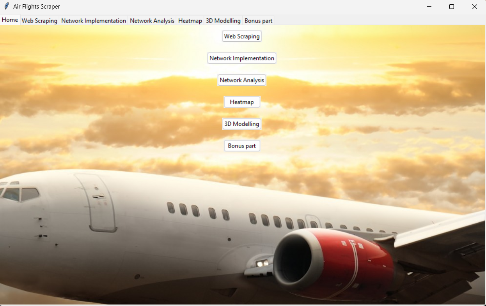
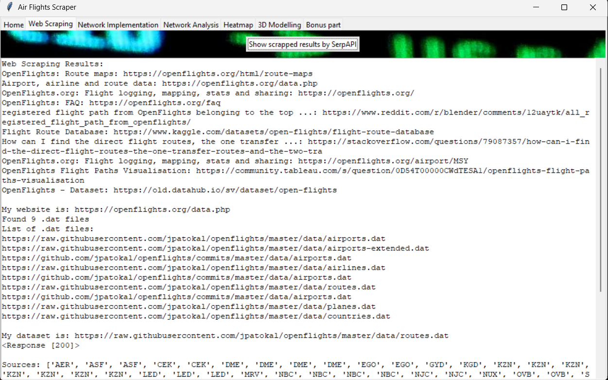
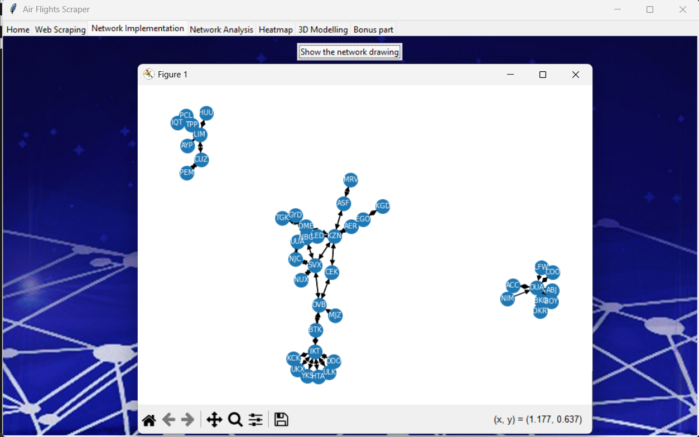
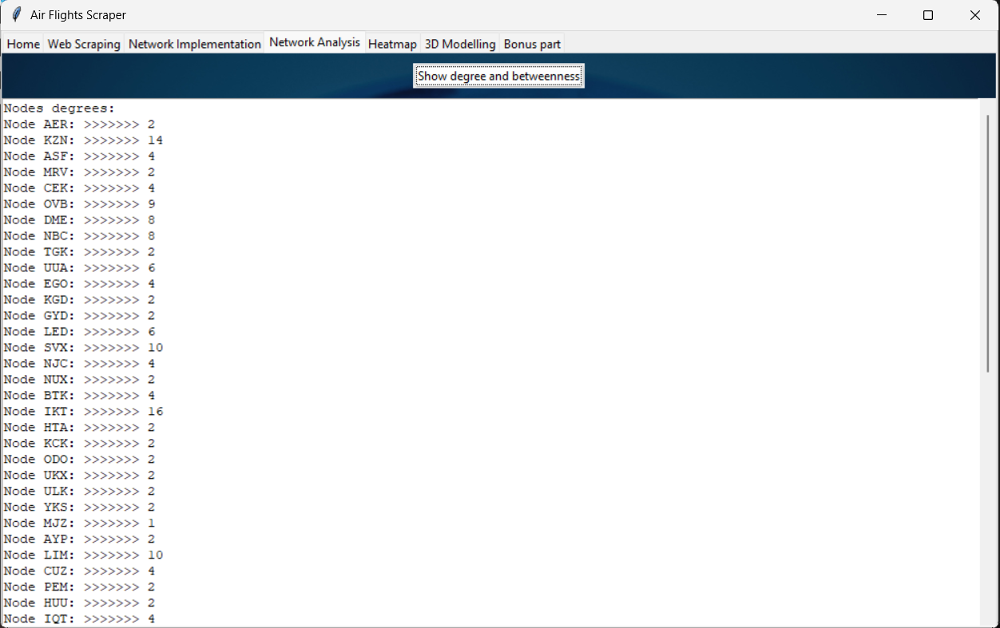
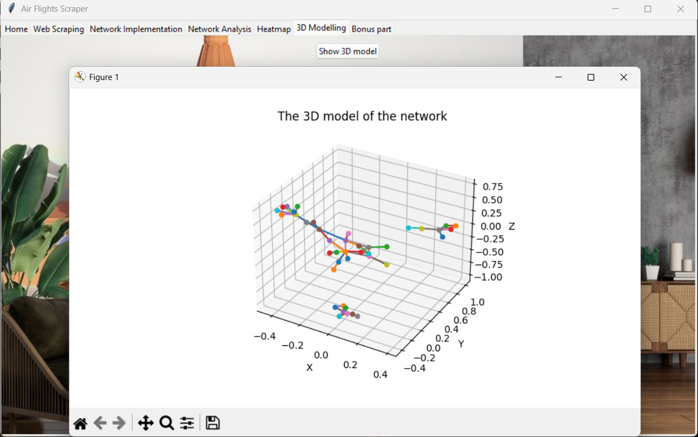

# ✈️ Air Flights Scraper

A Python GUI application built with `Tkinter` to visualize flight route data scraped using SerpAPI. The app allows users to scrape data, construct and analyze flight networks, generate 3D visualizations, plot heatmaps, and display various charts.

---

## 🖥 Features

- **Welcome Splash Screen**
- **Tabbed Interface** with:
  - `Home`: Navigate between functional modules
  - `Web Scraping`: Uses SerpAPI to extract flight route datasets
  - `Network Implementation`: Visualizes flight routes as a graph
  - `Network Analysis`: Calculates node degrees and betweenness centrality
  - `Heatmap`: Generates a KDE-based heatmap over mock coordinates
  - `3D Modelling`: Renders the network in 3D using Matplotlib
  - `Bonus part`: Displays pie, bar, and histogram charts of top flight routes

---

## 🧰 Requirements

Install required packages with:

```bash
pip install -r requirements.txt
```

Here’s a typical `requirements.txt` for this project:

```txt
tk
Pillow
serpapi
beautifulsoup4
matplotlib
numpy
networkx
opencv-python
```

---

## 🚀 How to Run

1. Ensure you have Python 3.x installed.
2. Place the following image files in the working directory:
   - `plane.jpg`
   - `home.jpg`
   - `web scraping.jpg`
   - `network.jpg`
   - `network analysis.jpg`
   - `heatmap.jpg`
   - `3d model.jpg`
   - `world.bmp`
3. Run the application:

```bash
python "GUI Ahmed acq.py"
```

---

## 🔑 Notes

- The script uses a **SerpAPI key** hardcoded in the script. Replace it with your own API key for real usage.
- Data is fetched dynamically and partially mocked (especially for heatmap generation).
- The GUI is optimized for screen resolution `1000x600`.

---

## 📸 Screenshots (Optional)






---

## 📄 License

This project is for educational university project.
